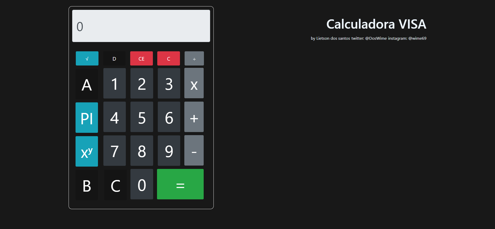

# Calculadora_visa
Basic calculator capable of performing basic calculations including PI value, square root and exponentiation

### demonstration

🚀 Tecnologias

-  HTML5
-  JavaScript
-  CSS3
-  Bootstrap4

Feito com ❤️ por Lietson dos santos 👋🏽 Entre em contato!

