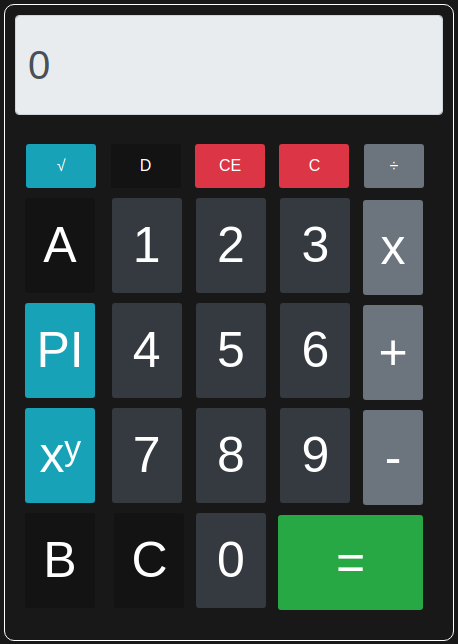

<h1 align="center">🏅 Calculator </h1>

<p align="center">
    
    &nbsp;&nbsp;
    &nbsp;&nbsp;
    
</p>

<p align="center">
    <a href="#Technology">Technology</a>&nbsp;&nbsp;&nbsp;|&nbsp;&nbsp;&nbsp;
    <a href="#Project">Project</a>&nbsp;&nbsp;&nbsp;|&nbsp;&nbsp;&nbsp;
    <a href="#Installation">Installation</a>&nbsp;&nbsp;&nbsp;|&nbsp;&nbsp;&nbsp;
    <a href="#Author">Author</a>&nbsp;&nbsp;&nbsp;|&nbsp;&nbsp;&nbsp;
    <a href="#License">License</a>
</p>

<h2 id="Project">💻 About the Project</h2>

This is a calculator capable of performing basic operations, I was also able to calculate the value of `PI`, exponentiation and square root.

## Imagem do Projecto


<br><h1 id="Installation">How To Use 🔧</h1>


<br>

```bash
# Clone this repository
$ git clone https://github.com/lietsondossanto/calculator

# Go into the repository
$ cd calculator

# run
$ firefox index.html
```

<br><h1 id="Technology">🚀 Technology</h1>


- HTML
- JAVASCRIPT
- CSS
- BOOTSTRAP

<h2 id="Author">Author<h2>

- **Lietson dos santos** - [https://github.com/lietsondossanto](https://github.com/lietsondossanto)

<h2 id="License">License 📄</h2>

This project is licensed under the MIT License - see the [LICENSE.md](LICENSE.md) file for details

[](https://twitter.com/https://twitter.com/lietsondossanto) [](mailto:lietsondossanto@gmail.com)
